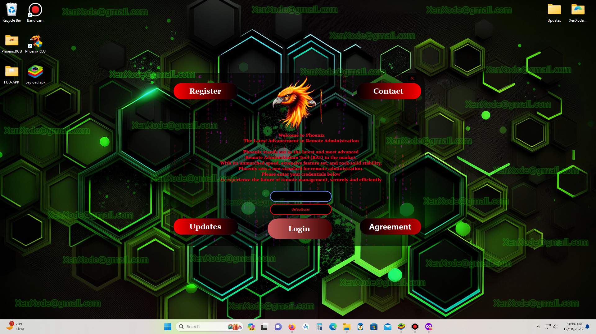
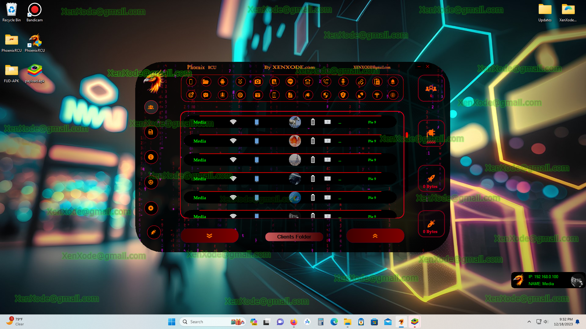

<h1 align=center>:PHOENIX RCU:</h1>

# 📁[𝐃𝗼𝐰𝐧𝐥𝐨𝐚𝗱](https://telegram.me/phoenixrpu)

## PHOENIX RCU FEATURES 

-  Live Screen View

- Control Screen (VNC)

-  Keyboard Control

-  Screen Unlock

-  Complete Call Logs

-  Delete calls

-  Download/Upload

-  Secure Delete Options

- Thumbnail/Gallery view

-  Advanced search

-  Copy/Paste

-  Decrypt/Decode

-  Hide / Unhide Files

-  Modify Clients Wallpaper 

-  Geo Tracker

-  Advanced SMS Sender

-  Send to unlimited numbers

-  Send to list from file

-  Send to all contacts

-  View Installed Apps

-  Launch Any All

-  Uninstall Any App

-  Disable / enable App

- Online/Live keylogger

- Offline keylogger

- Save Logs 

-  All keystrokes including

- Lock Screen pin or password
  
- Show SMS Logs

-  Delete SMS

-  Number Caller/Dialer

-  Apk Downloader via link

- Toast text on screen

- Clipboard Retriever

- Visit Any Link

- Run Commands

- Phisher for Gmail

- Phisher for Facebook

- Phisher for 2FA Google Authenticator Code

- View clients Accounts

- Watch screen touches

- Record user Touches

- Web browser Monitor

- Open any link in browser

- Bind with any legit app
  
- Anti Kill App

- Anti uninstall App

- Support screen wakeup

- Support Lock Screen

- Apk Crypter 

- Request Admin Rights

- Erase Device

- Take Photos 

- View Front Camera

- View Back Camera

- Gallery View
  
- Settings Controller
  
- Four (4) Languages for Phoenix    Dashboard

- English - Chinese
  
- Turkish - Portuguese
  
- Record clients actions completely

- Kill Switch
  
- Listen To Microphone

- Speak With Clients Mic

- Record clients Mic

- Get All Notification

- All Clients Texts Are Copiable
  
- Get all call alerts

- Record outgoing calls

- Record Incoming calls
  
- Black Screen Security Bypass

- Trust Wallet Security Bypass
- FUD APK STUB

-  Supports Android 13

- Hidden After installation

- Monitor selected apps

- View Home Screen Logs

- Send notifications clients

- Chinese Android Security Bypass
  
- Logins Hunter from any app
  
- Secured Connections
  
- Fast Control Speed
  
- FPS maximization
  
- Save All Client Logs
  
- Alert On Client Connection
  
- Hyper dashboard

# 📁[𝐃𝗼𝐰𝐧𝐥𝐨𝐚𝗱](https://telegram.me/phoenixrpu)
